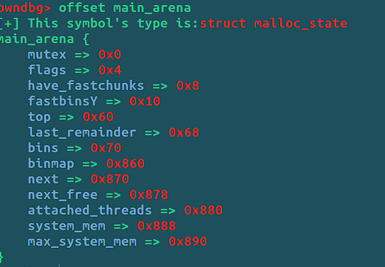

# gdb_script

# description

I appreciate the pwndbg, but i want to custom some function to debug something.

gdb script by python

just i am lazy:)

# how to use

just add you path to the `.gdbinit`

eg

```
python
sys.path.insert(0, '/home/pz1o/gdb_scripts')
import offset
end
```

# some function

- show the offset of a struct by finding a symbol

```
offset symbol
```



...

need to do

# Reference

[Symbols In Python (Debugging with GDB) (sourceware.org)](https://sourceware.org/gdb/current/onlinedocs/gdb/Symbols-In-Python.html#Symbols-In-Python)